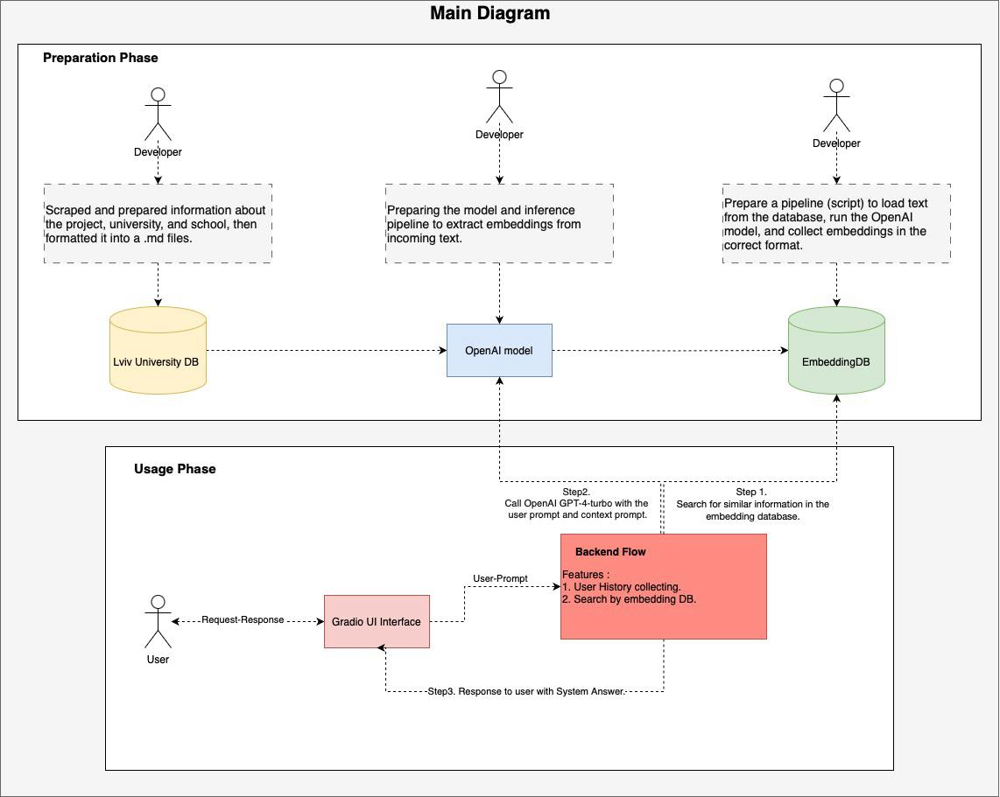
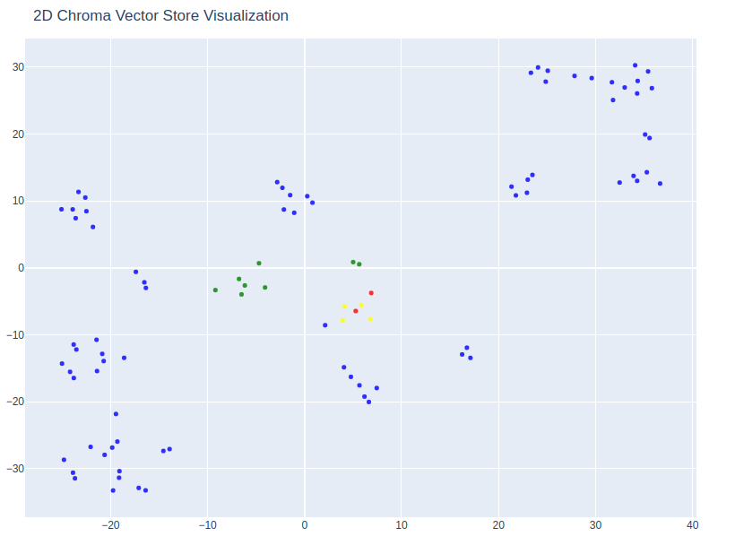
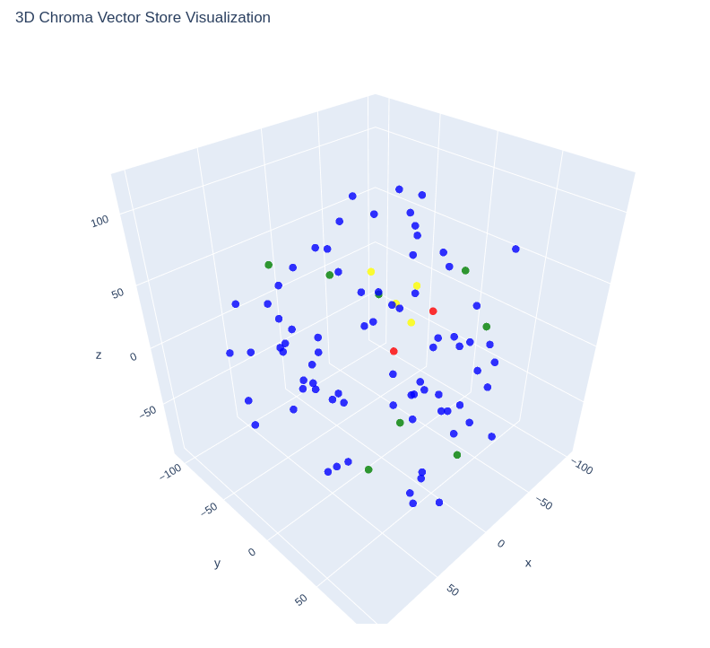
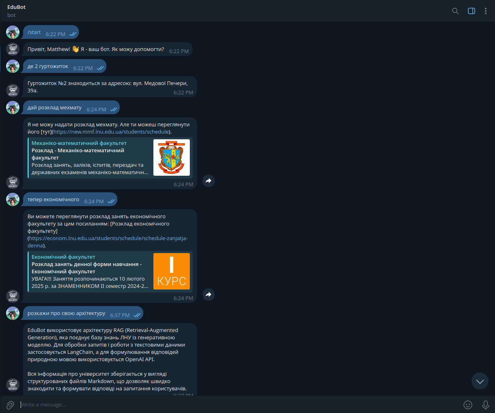
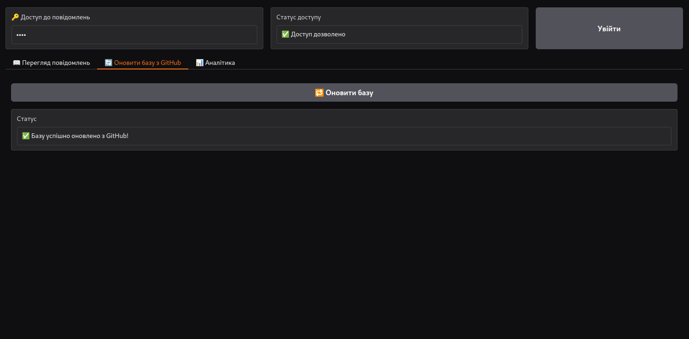
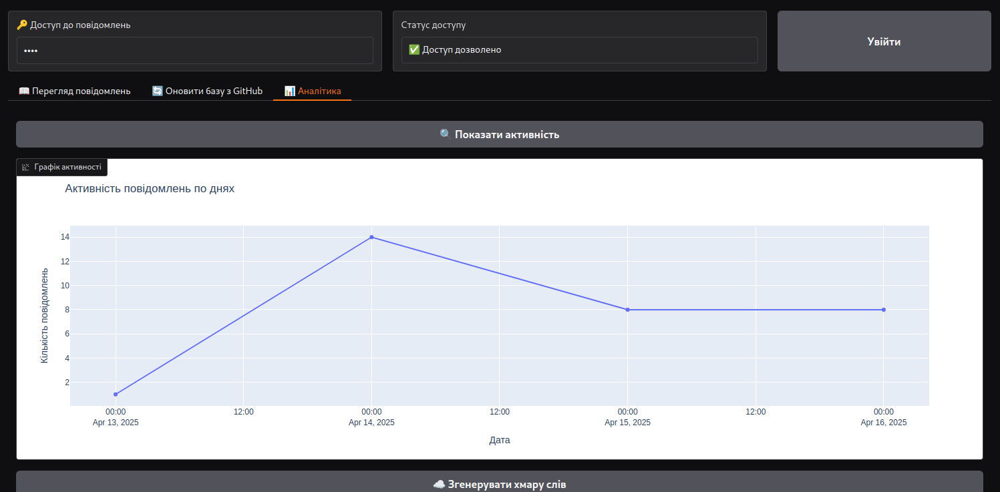
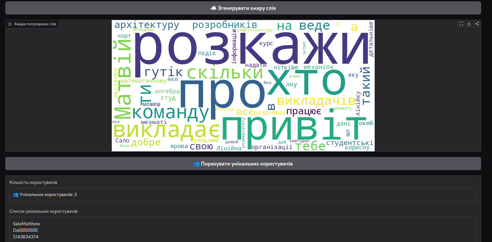
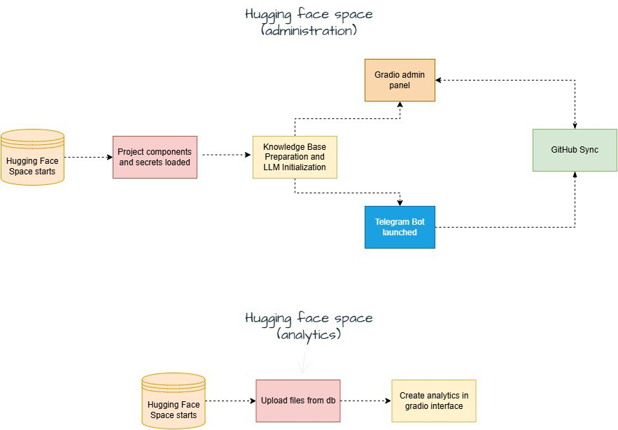

# 📘 EduBot – Документація (Dev + Deploy)

EduBot — це інтелектуальний асистент для університетів, який допомагає студентам, абітурієнтам та працівникам знаходити потрібну інформацію через Telegram-бота та вебінтерфейс.

Ця документація охоплює дві частини:
- 🧪 **Dev версія** — інструменти для embedding, векторизації та візуалізації знань
- 🚀 **Deploy версія** — готовий до використання Telegram-базований бот із Gradio аналітикою

---

## 📂 Структура проєкту

```
EduBot/
├── main/                               # Dev: ноутбуки, скрипти, knowledge-base
│   ├── main.ipynb
│   ├── visualize_vectors.py
│   ├── knowledge-base/
│   ├── vector_db/
│   ├── .env
│   ├── requirements.txt / environment.yml
│   └── README.md
├── insurellm-gpt/                      # Deploy: Telegram bot + Gradio
│   ├── app.py
│   ├── database.py
│   ├── knowledge-base/
│   ├── requirements.txt
│   ├── .env
│   └── README.md
├── chat-log-inspector/                 # Другий Hugging Face Space (аналітика)
│   ├── app.py
│   ├── database.py
│   ├── requirements.txt
│   ├── .env
│   └── README.md
```

---

## 🧪 Dev версія (embedding & visualization)

### 🔹 Призначення
- Створення векторного простору на базі знань
- Візуалізація схожості документів через PCA / UMAP

### 🔹 Як працює
```
Markdown → LangChain → Embedding → Chroma → Візуалізація
```

### 🧠 Загальна логіка Dev-процесу

<div style="position: relative; text-align: center; color: white;">
  
  <div style="position: absolute; top: 50%; left: 50%; transform: translate(-50%, -50%); color: black;">
  </div>
</div>

### 🖼️ Візуалізація векторів

Візуалізація embedding-даних допомагає інтерпретувати структуру знань.

#### 📍 2D-проєкція

<div style="position: relative; text-align: center; color: white;">
  
  <div style="position: absolute; top: 50%; left: 50%; transform: translate(-50%, -50%); color: black;">
  </div>
</div>

#### 📍 3D-проєкція

<div style="position: relative; text-align: center; color: white;">
  
  <div style="position: absolute; top: 50%; left: 50%; transform: translate(-50%, -50%); color: black;">
  </div>
</div>

---

## 🚀 Deploy версія (Hugging Face)

### 🔹 Telegram-бот
- Запускається з `app.py`
- Реалізовано через `pyTelegramBotAPI`
- Отримує повідомлення → додає до історії → надсилає у LangChain chain → повертає відповідь
- Обмеження на мову (українська)
- Зберігає повідомлення до `chat_logs.db`

#### 🤖 Приклад Telegram-чату

<div style="position: relative; text-align: center; color: white;">
  
  <div style="position: absolute; top: 50%; left: 50%; transform: translate(-50%, -50%); color: black;">
  </div>
</div>

### 🔹 База знань (спільна з Dev)
- Ті ж `.md` файли індексуються через Chroma
- Пошук по embedding здійснюється LangChain chain-ом

### 🔹 Gradio інтерфейс
- `app.py` генерує Gradio UI з паролем
- Вкладки:
  - 📊 **User Activity**
  - 📆 **Message Charts**
  - 📢 **Referrals**
  - 🔎 **Referral Lookup**

### 🖼️ Приклади інтерфейсу Gradio

<div style="display: flex; justify-content: center; gap: 20px;">
  <div style="text-align: center;">
    
    <p>📊 Графік активності</p>
  </div>
  <div style="text-align: center;">
    
    <p>🔁 Частотність слів</p>
  </div>
</div>

<div style="display: flex; justify-content: center; gap: 20px;">
  <div style="text-align: center;">
    
    <p>👥 Унікальні користувачі</p>
  </div>
  <div style="text-align: center;">
    
    <p>🔎 Деталізація повідомлень</p>
  </div>
</div>

---

## 🔗 Онлайн версії

### 🚀 Deploy (Hugging Face)
- 🧭 **Основна логіка**: [insurellm-gpt](https://huggingface.co/spaces/smattheww/insurellm-gpt) — основний модуль, який реалізує пошук у базі знань за допомогою LangChain, зберігає повідомлення, підтримує реферальну аналітику та забезпечує Gradio-інтерфейс для адміністрування роботи проекту.
- 📊 **Аналітика та огляд історії**: [chat-log-inspector](https://huggingface.co/spaces/smattheww/chat-log-inspector) — Gradio-додаток для перегляду збережених повідомлень, аналізу активності, частоти запитів і користувачів.

### 🧪 Dev версія (GitHub)
- 🔧 **Розробка та експерименти**: [EduBot repository](https://github.com/Matviy-commands/EduBot) — репозиторій з embedding-системою, індексацією знань, візуалізацією векторів, прикладами коду та структуруванням бази знань.

---


## 🔄 База даних

SQLite файл `chat_logs.db` містить:

### 📌 Таблиці:
- `messages`: `user_id`, `message`, `response`, `timestamp`
- `referrals`: `user_id`, `code`, `timestamp`

> 💾 Ця база синхронізується з GitHub через `GITHUB_TOKEN`

---

## 📈 Архітектура (діаграма)

Нижче представлено загальну схему архітектури системи EduBot, яка показує як Dev-частина (embedding + візуалізація) та Deploy-частина (Telegram-бот та Gradio UI) взаємодіють через спільну векторну базу знань (Chroma):

```
Markdown Files
     ↓
LangChain Loaders
     ↓
Embedding → Chroma
     ↓             ↘
Gradio UI        Telegram Bot
```

<div style="position: relative; text-align: center; color: white;">
  
  <div style="position: absolute; top: 50%; left: 50%; transform: translate(-50%, -50%); color: black;">
  </div>
</div>

---

## ⚙️ Розгортання Hugging Face

1. Створи Hugging Face Space з типом “Gradio”
2. Завантаж:
   - `app.py`, `database.py`
   - `chat_logs.db`, `.env`, `knowledge-base/`
   - `requirements.txt`
3. Налаштуй Secret variables (API ключі)
4. Запусти Space

---

## 🧪 Запуск Dev локально

```bash
git clone https://github.com/Matviy-commands/EduBot.git
cd EduBot
pip install -r requirements.txt
python main/visualize_vectors.py
```

---

## 📬 Контакти

Проєкт створено командою Forwards. Зв’язатися: `+380 68 821 20 61`
